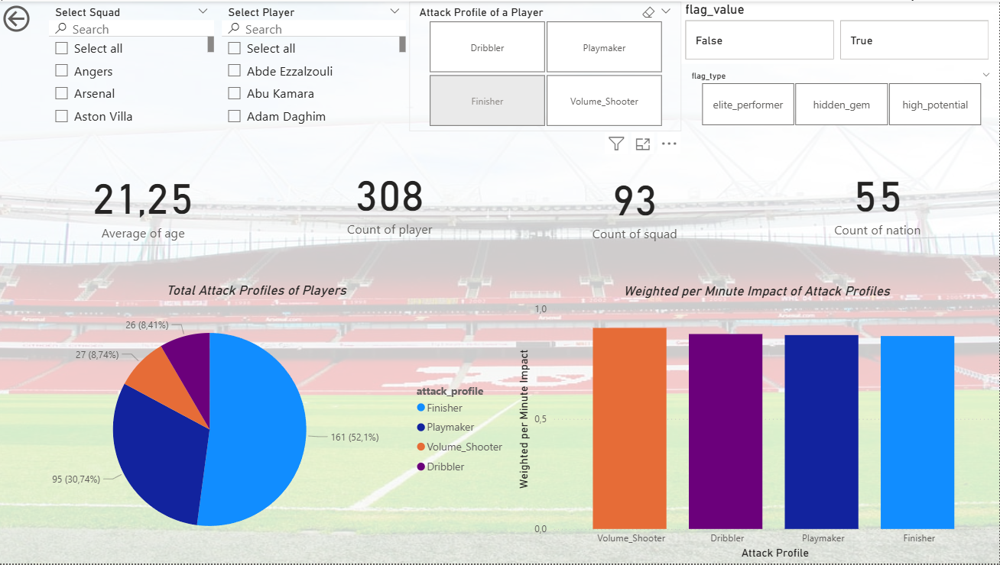
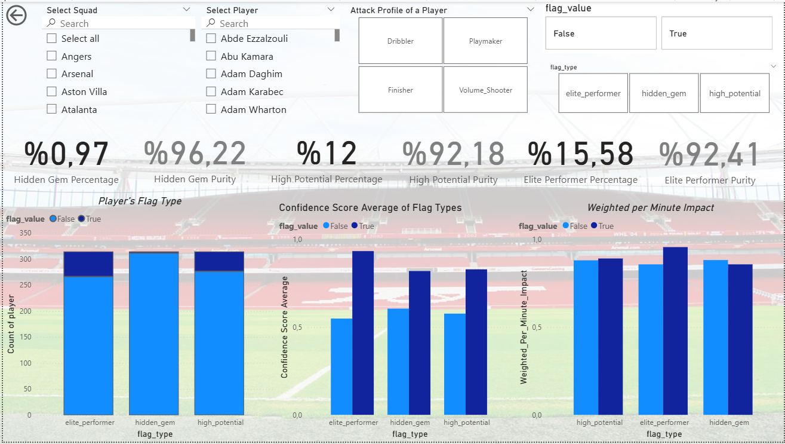
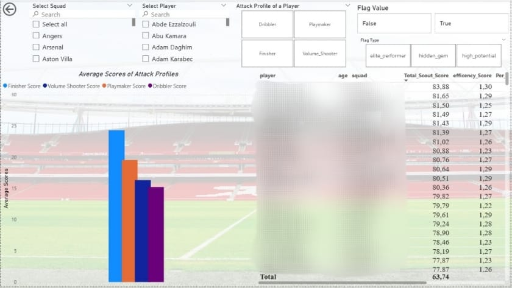
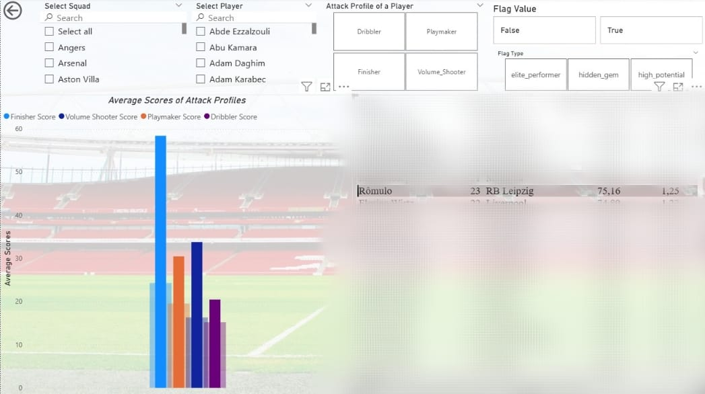
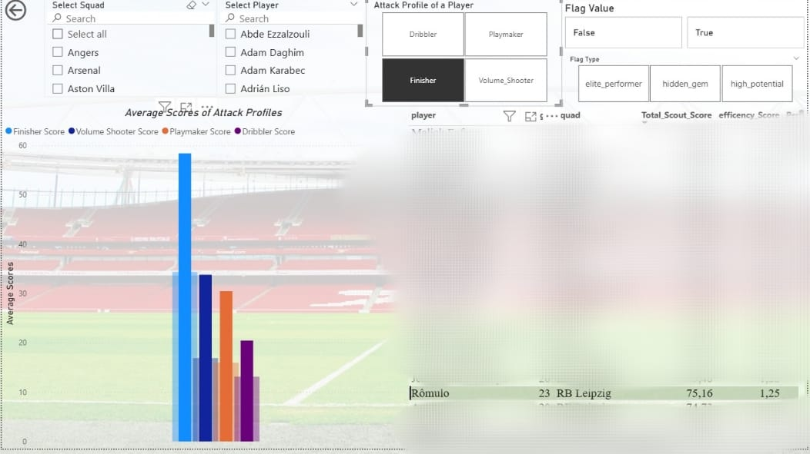
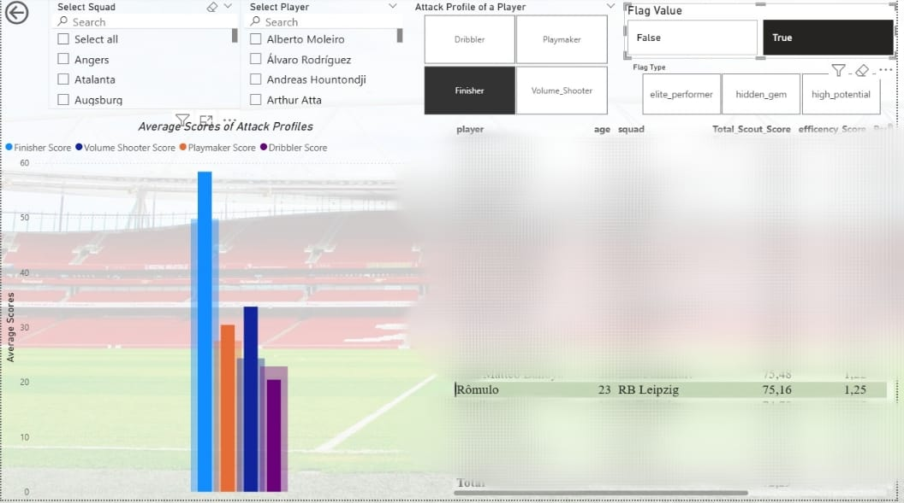
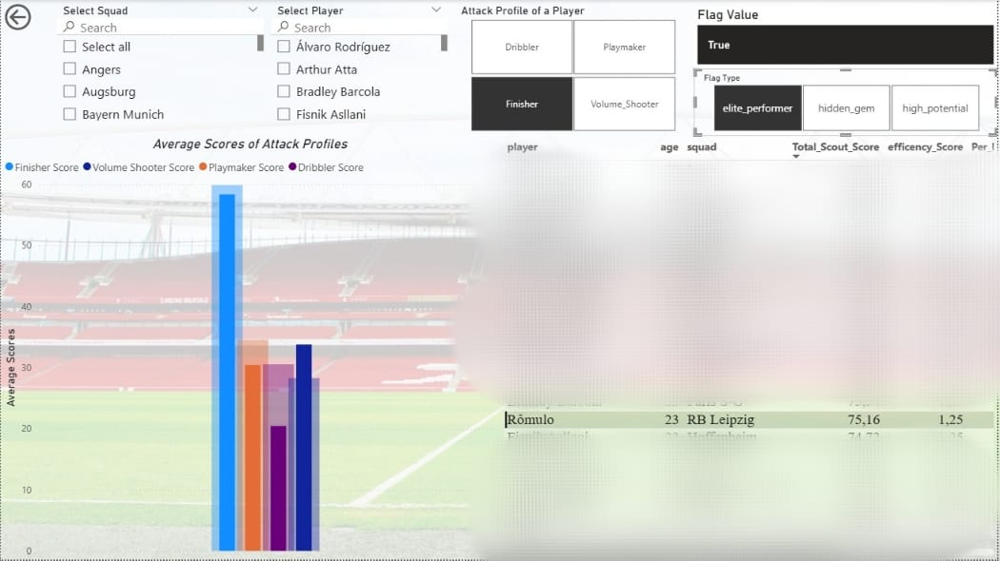

# ⚽ Football Analytics: U23 Attack Profile Classification & Scouting

## 📚 Table of Contents
- [Project Overview](#overview)
- [Methodology](#methodology)
  - [Data Acqusition](#data-acquisition)
  - [Feature Engineering](#feature-engineering)
  - [Profile Classification](#attack-profile-classification)
      - [Profile Validation](#profile-validation)
  - [Flag System](#flag-system)
      - [Flag Validation](#flag-validation)
  - [Scoring Methodology](#scoring-methodology)
- [Interactive Dashboard](#interactive-dashboard)
- [Automated Updates](#automated-updates)
- [Author](#author)

## Overview
This project implements a scouting pipeline that scrapes performance data for 2,176 players using Selenium and BeautifulSoup, analyzes 48+ statistical metrics, and classifies U23 attacking players into distinct profiles. 

### Design Phiosophy
Empirical performance analysis to discover undervalued talent before market recognition occurs. **Transfermarkt valuations are intentionally excluded to focus on statistical output rather than perception-driven pricing.**

## Methodology
### Data Acquisition

Automated web scraping pipeline using Selenium and BeautifulSoup4 to extract comprehensive statistical tables from FBref. 

Data collected for 2,176 players across Europe's Top 5 leagues, merged into a unified master dataset, then **filtered for U23 attacking players with minimum 90 minutes played**.

### Feature Engineering

From 191 available metrics, **15 key performance indicators** were selected through statistical validation and grouped into three analytical dimensions:

* Finishing Metrics (xG differential, shot accuracy, conversion rates), 

* Ball Carrying Metrics (progressive carries, take-on success, dribbling efficiency), and 

* Individual Impact Metrics (goal-creating actions, shot-creating actions, chance creation rates).

Metrics were individually scaled with RobustScaler applied to outlier-prone variables and StandardScaler (or adaptive alternatives like PowerTransformer or QuantileTransformer) used otherwise, based on distributional characteristics and skewness.

Profile scores were calculated as the mean of z-scored metric groups per profile. Following **Reference Distribution Alignment (RDA)** to standardize scale and preserve variance balance, all profile scores were re-normalized (0–100 range).

The player’s dominant profile was assigned based on the highest aligned mean score.

### Attack Profile Classification
Four distinct playing styles identified through dimensional scoring: 
* **Finisher** - Metrics related to goal conversion and shot accuracy  

* **Volume Shooter** - Metrics emphasizing shot frequency and set-piece attempts 

* **Dribbler** - Metrics representing take-on activity and success  

* **Playmaker** - Metrics linked to goal- and shot-creating actions 

Profiles were derived by computing normalized averages of specific metric clusters that represent distinct attacking behaviors

### Profile validation

* **Consistency Analysis**
    
    Consistency was assessed by calculating the standard deviation of profile scores within each profile category (Finisher, Volume Shooter, Dribbler, Playmaker). 

    A lower standard deviation indicates higher internal consistency, meaning players within a profile exhibit similar characteristics. Additionally, a dominance ratio was computed as the profile's average score divided by its standard deviation, where a higher ratio reflects stronger profile coherence. 

    Results showed low standard deviations across all profiles, confirming robust internal consistency.

* **Separation Analysis**

    Profile separation was evaluated using the silhouette score, which measures how well players align with their assigned profile compared to others. Profiles mapped to numerical labels (Finisher: 0, Dribbler: 1, Playmaker: 2, Volume Shooter: 3). 

    Metrics were standardized using StandardScaler, and silhouette scores were calculated on the scaled data. Scores closer to 1 indicate strong separation. Additionally, profile balance was assessed by computing the standard deviation of player counts across profiles relative to the mean count. 

    Results indicated enough silhouette scores and balanced profile distributions, confirming clear separation between profiles.

* **Realism Analysis**

    Realism was validated by examining the average profile scores (normalized to 0–100) for players within each profile. For each profile, the mean score of relevant metrics (or the designated profile score column) was computed to ensure scores reflect realistic performance levels. 
    
    Higher average scores indicate stronger alignment with the profile's defining characteristics. The analysis confirmed that all profiles exhibited meaningful score distributions, with average scores aligning with expected behavioral patterns for each category.

### Flag System
Three value flags applied based on statistical thresholds and playing time analysis:

* **Elite Performer** — Represents the top 20% of players by overall impact percentile, typically those combining high productivity and consistent minutes  indicating established top-tier contributors.

* **High Potential** — Includes players within the top 40% of overall impact who also maintain moderate-to-high playing time ranges. This group highlights promising young talents demonstrating strong performance indicators under meaningful workloads.

* **Hidden Gem** — Captures players ranked in the top 25% for overall impact but within the bottom 30% for minutes played. These are underutilized yet highly efficient performers whose statistical output suggests value exceeding current role exposure.

All flag classifications were derived from **quantile-ranked** impact and minute percentiles, ensuring comparability across competitions and age groups.

Each flag was complemented by a **weighted composite score** (impact vs. minutes balance) to refine prioritization within the same flag category, maintaining consistency between efficiency and exposure.

### Flag Validation 

* **Confidence scores**

Calculated for each player based on their impact rank (derived from normalized aggregate contributions across attacking profiles) and minutes rank. For each flag

**Hidden Gem**: Scores range from 0.5 to 1.0, emphasizing high impact relative to low minutes.

**Elite Performer**: Scores start at 0.6, scaled by the average of impact and minutes ranks, reflecting high productivity and consistent playtime.

**High Potential Youth**: Scores start at 0.55, scaled by the average of impact and minutes ranks, targeting promising players with moderate-to-high minutes.

**Other**: Baseline score of 0.4, adjusted by impact rank for unclassified players. The maximum score was selected for players with multiple flags.  

* **Quality Checks** 

**Hidden Gem**: Validated by confirming low minutes (≤25th percentile, with a high proportion meeting this criterion.

**Elite Performer**: Validated by high minutes (≥75th percentile), ensuring alignment with consistent playtime.

**High Potential**: Validated by players falling within ideal ranges (impact rank: 60th–80th percentile; minutes rank: 50th–70th percentile).

**Other**: Validated by mid-range impact ranks (40th–70th percentile), reflecting mixed performance.

* **Purity**

For each flag, the standard deviation of impact and minutes ranks was calculated. Lower standard deviations indicate higher purity (consistency within the flag).

A purity score was derived as 1 minus the average of impact and minutes standard deviations, with higher scores indicating tighter clustering.The proportion of players per flag was also computed to ensure meaningful sample sizes.

Results demonstrated high purity scores across all flags, with low standard deviations in impact and minutes ranks, confirming that players within each flag share similar characteristics.

## Scoring Methodology

* **Overall Impact Score (0-100)** 

Raw Score = SUM(all profile percentile scores)

**Overall Impact** = RANK(Raw Score) × 100

Aggregates multiple profile scores (attacking metrics) into a single percentile-ranked impact metric. Each profile score is individually ranked as percentile (0-1), summed, and then re-ranked to create the final 0-100 scale.

* **Per Minute Impact (0-1)** 
 
 **Per_Minute_Impact** = ((1 - Impact_Rank) + (1 - Minutes_Rank)) / 2

Combines normalized impact efficiency with normalized playing time distribution. 

Creates a composite score where:
Higher Impact Rank (less minutes played with high impact) = higher efficiency
Penalty applied for low minutes even with high impact

* **Efficiency Score (1-2)** 

Normalized Impact = 1 - Impact_Rank

Normalized Minutes = 1 - Minutes_Rank

Time Efficiency = LOG₁₀(Normalized Minutes + 1) + 1

**Efficiency Score** = Normalized Impact × Time Efficiency

Combines performance quality (impact rank) with sample reliability (minutes rank)

Logarithmic time efficiency rewards consistency while penalizing 
sporadic brilliance

Players with high impact in few minutes get boosted; sporadic performers are downweighted

* **Total Score Hierarchy** 

Strategic priority index integrating validated performance, age-adjusted growth ceiling, market visibility, and data confidence. 

* **Age Factor** 
 1 + ((23 - PlayerAge) × 0.02)

Rewards younger players with higher growth ceiling

* **Sample Confidence**
0.6 + (0.4 × (1 - MinutesRank))

Penalizes insufficient data; rewards validated sample size

* **Market Discovery**

1 + ((1 - MinutesRank) × 0.075)

Low minutes rank (high minutes played) → minimal bonus (1.0x)

High minutes rank (few minutes) with high impact → maximum bonus (1.075x)

* **TOTAL SCORE (0-100)**

Raw Score = Efficiency_Score × Age_Factor × Sample_Confidence × Market_Discovery

**Total Score** = (Raw_Score / 3.5) × 200

The divisor (3.5) and multiplier (200) normalize the raw composite score to a practical 0-100 scale.

**This framework prioritizes efficient performers in limited roles (high impact per minute) while accounting for reliability (sample size), youth potential (age), and market inefficiency (undervalued discoveries).**

## Interactive Dashboard

A 12-page Power BI dashboard provides comprehensive analysis including:
- Player profile distributions and comparative metrics
- Talent flag breakdowns and efficiency rankings
- Squad-level aggregations and age cohort analysis
- Interactive filters for profile, team, and nation

### Dashboard Preview

* Some photos about my powerBI dashboard

* For example, a brief demonstration of how to use the dashboard for a player

  
  
    * When you click on Romulo in the player table on the right, if the other slicers are not active, you can see Romulo's scores based on his average attack profiles in the table on the left (among all players).
  
  
  
    * If you only want to look to the player among finishers, you see Romulo's attack profile scores distribution among just finishers in the left table (those have higher finisher scores)

  

    * This time, you can see the Romulo's profile scores among finishers with at least one flag.
 
    

    * Finally, if you click on elite performer slicer, you can see Romulo's performance only among elite performers in finishers.
 
  * When the player was analyzed, it was noticed that while no slicer was selected, the player's overall scores were above average. However, as seen in the last photo, when the player was analyzed as a finisher elite performer, the player could be seen as an average player for that category.
 
  * This type of analysis can be done not only on an individual player basis but also on a team basis, allowing you to see which players are on the team and how they are distributed.

## Automated Updates

**Weekly Refresh Schedule:** Every Sunday at 00:00 UTC
- Automated scraping of latest FBref statistics
- Profile recalculation and ranking updates
- Dashboard synchronized with current season data

### Design Principles
This framework provides objective performance metrics to support scouting decisions, not replace human judgment. Scout departments, scouting platforms, and sports analysts retain full autonomy to apply domain expertise, video analysis, and contextual assessment. The tool is designed for discovery and prioritization, not prescriptive decision-making.

## Disclaimer

Educational project. Performance data sourced from FBref and subject to reporting limitations. Scouting recommendations should be validated through professional analysis, video review, and contextual evaluation.

## License
Licensed under the Apache License 2.0. 

## Author

**Ata Soytürk**

Çankaya University Computer Engineering Student

[Email] (atasoyturkk@gmail.com)

[LinkedIn] (https://www.linkedin.com/in/ata-soyt%C3%BCrk/)

