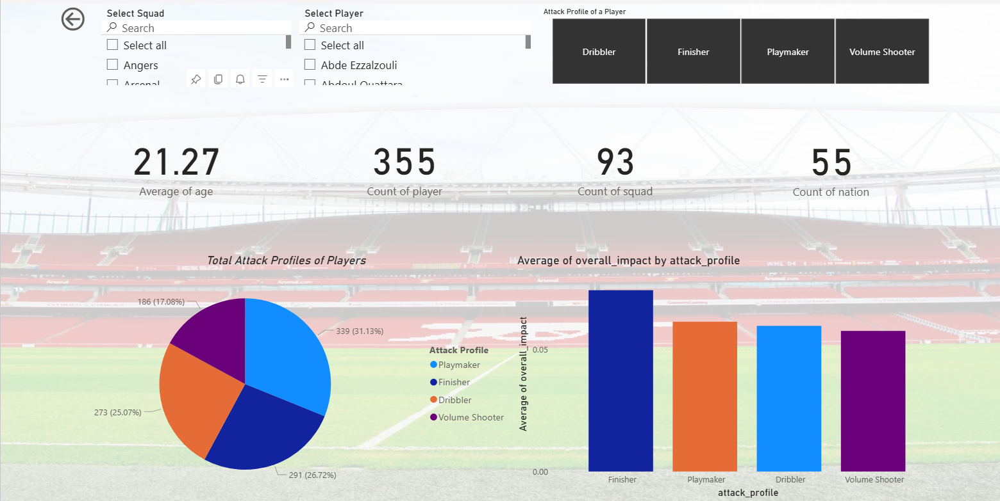
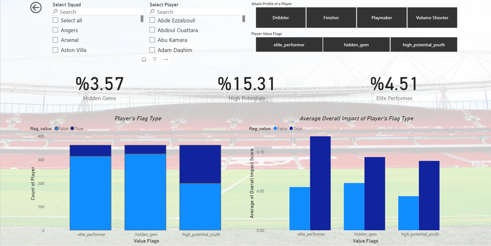
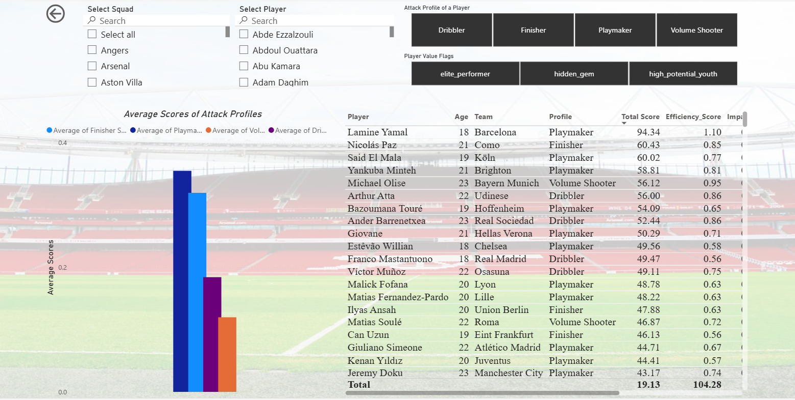

# ⚽ Football Analytics: U23 Attack Profile Classification & Scouting

##  A statistical framework for identifying attacking talent under 23 in Europe's Top 5 leagues through data-driven performance analysis.

### Overview
This project implements an end-to-end scouting pipeline that scrapes performance data for 2,176 players using Selenium and BeautifulSoup, analyzes 48+ statistical metrics, and classifies U23 attacking players into distinct profiles. 


### Core Philosophy

Empirical performance analysis to discover undervalued talent before market recognition occurs. **Transfermarkt valuations are intentionally excluded to focus on statistical output rather than perception-driven pricing.**

## Methodology
### Data Acquisition

Automated web scraping pipeline using Selenium and BeautifulSoup4 to extract comprehensive statistical tables from FBref. 

Data collected for 2,176 players across Europe's Top 5 leagues, merged into a unified master dataset, then **filtered for U23 attacking players with minimum 90 minutes played**.

### Feature Engineering

From 191 available metrics, **15 key performance indicators** were selected through statistical validation and grouped into three analytical dimensions:

* Finishing Metrics (xG differential, shot accuracy, conversion rates), 

* Ball Carrying Metrics (progressive carries, take-on success, dribbling efficiency), and 

* Individual Impact Metrics (goal-creating actions, shot-creating actions, chance creation rates).

Statistical transformations applied using RobustScaler for outlier-prone metrics and StandardScaler for stable distributions. Z-score normalization enables cross-metric comparison and profile identification.


### Attack Profile Classification
Four distinct playing styles identified through dimensional scoring: 
* **Finisher** (goal conversion specialists), 

* **Volume Shooter** (high-frequency shooters with set-piece involvement), 

* **Dribbler** (1v1 specialists with progressive carrying), 

* **Playmaker** (creative facilitators with high GCA/SCA rates). 

Profiles assigned based on highest mean z-score across relevant metric groups.


### Talent Classification System
Three value flags applied based on statistical thresholds and playing time analysis:

* **Elite Performer** — Top 10% overall impact score. Established high-level contributors with validated performance.

* **High Potential** — Top 40% overall impact among age cohort. Promising talents with strong metrics relative to experience.

* **Hidden Gem** — Top 30% impact despite bottom 40% minutes played. Underutilized players with exceptional per-minute efficiency.


## Scoring Methodology

* **Overall Impact Score (0.00-0.50)** 

 Normalized average of 15 core metrics using MinMaxScaler. Represents multi-dimensional offensive contribution.

* **Efficiency Score** — Overall Impact × (1 + log₁₀(Minutes/90)). 

Combines performance quality with sample reliability, rewarding consistency over sporadic output.

* **Total Score (0-100)** 

Strategic priority index integrating validated performance, age-adjusted growth ceiling, market visibility, and data confidence. 

Calculated as:

 Efficiency Score × Age Factor (1.0x-1.7x) × Market Discovery Multiplier (1.0x-1.5x) × Sample Confidence (0.6-1.0).

Younger players receive higher age multipliers to reflect development potential. 
Lower minute totals increase market discovery multipliers to identify undervalued opportunities. Sample confidence penalizes insufficient data to ensure statistical validity.

## Interactive Dashboard

A 9-page Power BI dashboard provides comprehensive analysis including:
- Player profile distributions and comparative metrics
- Talent flag breakdowns and efficiency rankings
- Squad-level aggregations and age cohort analysis
- Interactive filters for profile, team, and nation

### Dashboard Preview

* Some photos about my powerBI dashboard







## Automated Updates

**Weekly Refresh Schedule:** Every Sunday at 00:00 UTC
- Automated scraping of latest FBref statistics
- Profile recalculation and ranking updates
- Dashboard synchronized with current season data

### Design Principles
This framework provides objective performance metrics to support scouting decisions, not replace human judgment. Scout departments, scouting platforms, and sports analysts retain full autonomy to apply domain expertise, video analysis, and contextual assessment. The tool is designed for discovery and prioritization, not prescriptive decision-making.


## Disclaimer

Educational project. Performance data sourced from FBref and subject to reporting limitations. Scouting recommendations should be validated through professional analysis, video review, and contextual evaluation.

## Folder Structure
```
football-analytics-u23-scouting/
├── scraper/              
│   ├── setup.py            # Selenium driver configuration
│   └── extract.py          # FBref data extraction logic
├── db/                   
│   └── save_all_tables.py  # SQLite storage handler
├── analysis/             
│   ├── master_table.py     # Dataset merging and cleaning
│   ├── preprocessing.py    # Scaling and normalization
│   ├── player_finding.py   # Profile classification
│   └── utils.py            # Helper functions
├── scheduler/            
│   └── job.py              # Weekly update scheduler
├── data/
│   ├── data.db             # SQLite database
│   
├── reports/
│   ├── scouting_youth.pbix # Power BI dashboard
│   └── scouting_youth.pdf   
├── main.py              
├── config.py               # Configuration settings
└── requirements.txt
```


## License
Licensed under the Apache License 2.0. 

## Author

**Ata Soytürk**

Çankaya University Computer Engineering Student

[Email] (atasoyturkk@gmail.com)

[LinkedIn] (https://www.linkedin.com/in/ata-soyt%C3%BCrk/)


